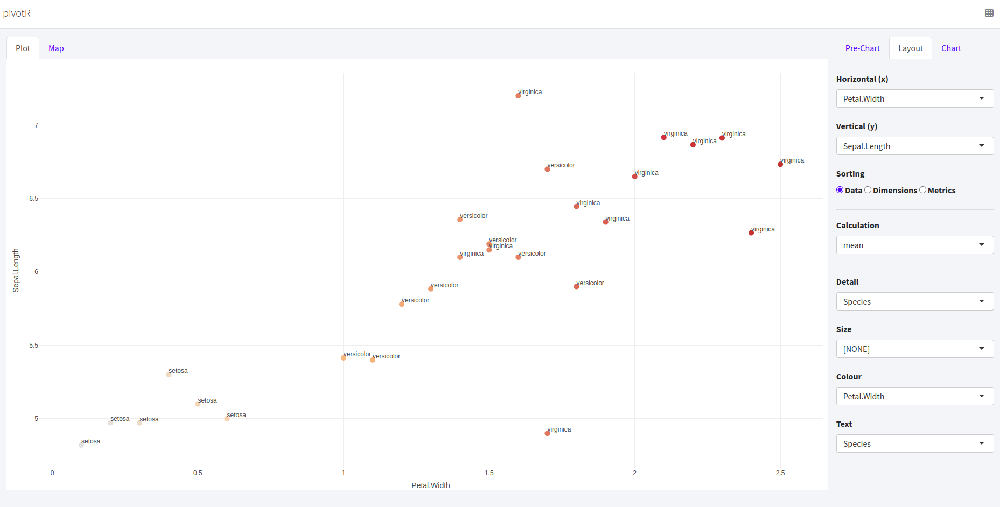

# pivotR

<!-- badges: start -->
<!-- badges: end -->



PivotR is a plugin for RStudio that is inspired by the data pivoting approach found in Tableau. It helps with fast, graphical investigation of data frames. If you're faced with a csv you've never loaded before, pivotR is an intuitive and visual way to explore that data.

You can run PivotR by entering `pivotR::pivotR(dataframe)` but the package is intended to run as an RStudio addin. Simply highlight the name of a data frame in a script and press a keyboard shortcut to launch a graphical browser on that data.

## Installation

Install the development version of pivotR from [GitHub](https://github.com/) with:

``` r
# install.packages("remotes")
remotes::install_github("neilcharles/pivotR")
```

Once pivotR is installed, launch it on a data frame by running:

``` r
library(pivotR)
pivotR(iris)
```

## Assigning a keyboard shortcut

Running using a keyboard shortcut is much more efficient. In RStudio, navigate to:
Tools > Addins > Browse Addins...
and assign a keyboard shortcut of your choice to pivotR. You may need to restart RStudio after installation of pivotR for it to appear in the addins list.

Now, simply highlight the name of a data frame anywhere in a script and press your keyboard shortcut to launch pivotR.

## How it works

User guide coming soon. It's not too complicated, give it a try!
